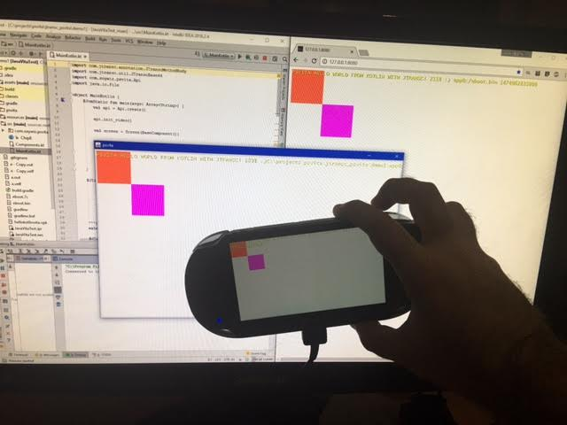

## psvita-java

This is a mixed Java+Kotlin demo that can run in the JVM, the browser and PSVita,
and could be easily ported to other platforms like 3DS among others.

In PSVita/C++ it uses ARC instead of GC, so the performance is constant and doesn't
have any delays. It works thanks to [JTransc](https://github.com/jtransc/jtransc) +
the great new C++ target in 0.4.0 done by [dsp-omen](https://github.com/dsp-omen).
For drawing without dependencies on psvita, it uses xerpi's [draw.c](https://github.com/xerpi/libftpvita/blob/master/sample/draw.c) from a sample in libftpvita.

## Run in the PSVita

Go to `demo1` directory, and with the vitasdk installed and `VITASDK` environment variable properly set, execute `gradlew buildVita`.
That will generate a vpk file that can be uploaded to a psvita with henkaku.

You can also execute: `installFtp` that will upload via ftp to the ip in env `VITAFTP`, and will promote it with VitaShell >= 0.95.

## Run in the Browser

Go to `demo1` directory and run `gradlew distJs`. It will generate `build/jtransc-js/index.html` that you can serve along the `program.js` file with any webserver.

## Run in the JVM

Go to `demo1` directory and open `build.gradle` with intelliJ (Community Edition is ok).
