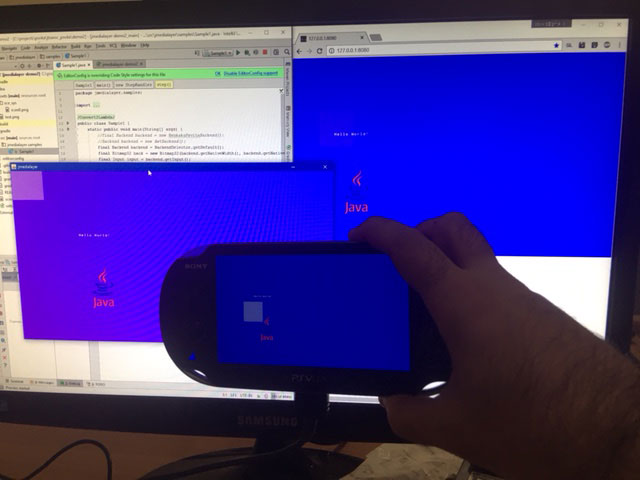

### Second Demo:

This demo includes the jmedialayer library that provides portable media funcionalities (for psvita and other platforms):

* https://github.com/jmedialayer/jmedialayer/

This demo is able to display an image:

```
gradle installFtp
```

Output file is now in `build/distributions/jmedialayer-demo2.vpk`

